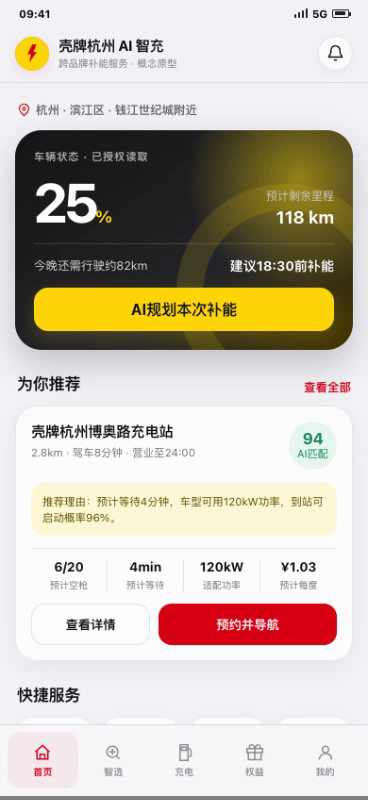
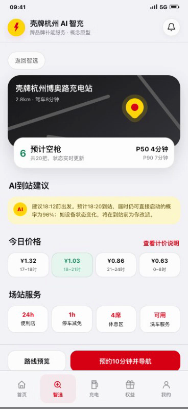
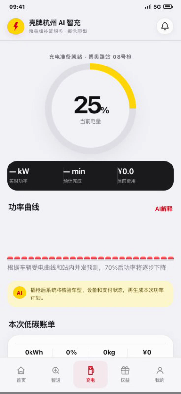
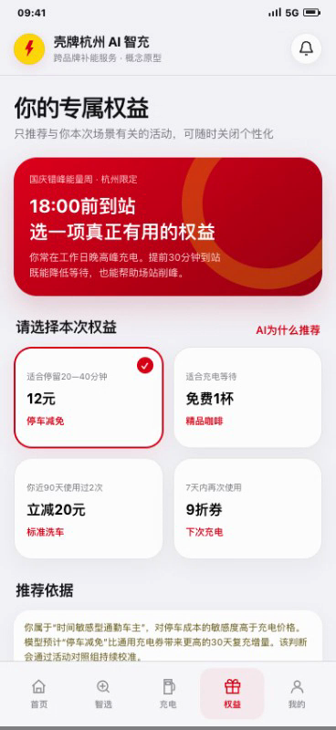
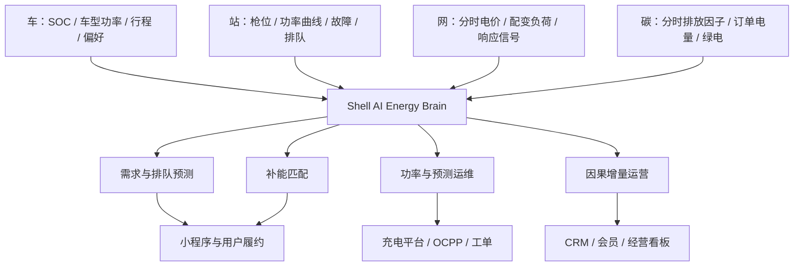

# 壳牌 × 杭州 · AI 能源大脑

> 车 · 网 · 碳一体化的城市能源转型商业解决方案  
> 2026 未来能源领袖计划 · AI + 能源创新商业挑战赛｜清能智策队

[在线体验 Demo](http://hawk-knko.upma.site/) · [查看路演 PDF](docs/清能智策队-终稿.pdf) · [下载完整 PPT](docs/清能智策队-终稿.pptx) · [观看 60 秒演示](assets/demo-60s.mp4)

## 项目概览

杭州的新能源汽车与充电基础设施持续增长，但用户仍面临“到站是否有枪、要等多久、实际能充多快”的不确定性；场站则面临冷热不均、故障停机、峰值电费与通用补贴侵蚀利润等问题。

本项目提出“壳牌杭州 AI 能源大脑”：连接车辆、场站、电网与碳排四类数据，以 AI 驱动站点推荐、充电履约、功率调度、预测运维和会员经营。核心目标不是单纯增加充电桩，而是让每一次补能都更可预测、可履约、可盈利。

## 阅读导航与 60 秒体验路线

**看产品：** [用户旅程](#demo-用户旅程) → [页面导航](#页面导航与体验重点)。**看技术：** [技术架构](#技术架构) → [四个决策环节](#四个决策环节的输入输出与验收)。**看商业：** [商业模式](#商业模式与-roi把收益和成本放在同一口径) → [试点设计](#试点设计)。

| 演示顺序 | 建议停留 | 向访问者说明什么 |
| --- | --- | --- |
| 首页与补能匹配 | 15 秒 | 用户不是只要最近的桩，而是需要时间、价格与可用性可预期 |
| 站点详情 | 10 秒 | 推荐需要解释停车规则、等待风险和备选方案 |
| 充电页 | 10 秒 | 把完成时间和功率变化转成用户能理解的信息 |
| 权益页 | 10 秒 | 活动既要匹配需求，也要核算增量收益与成本 |
| 我的与设置 | 15 秒 | 偏好、账单和数据授权构成持续服务，而非一次性营销 |

这条路线展示的是一个可交互的产品假设。正式试点应把页面事件与真实业务回执分开：浏览推荐不是有效到站，点预约不是设备已预留，领取权益也不等于新增复充。对应埋点与验收口径需要在接入运营系统时确定。

## 核心方案

| 决策引擎 | AI 能力 | 业务动作 | 关键指标 |
| --- | --- | --- | --- |
| 需求与排队预测 | 预测未来 15–60 分钟到站量、可用枪位和 P50/P90 等待时间 | 识别高峰与空间需求，提前分流 | 到站转化率、平均等待时间、利用率 |
| 补能匹配 | 综合路程、等待、充电时长、费用、失败风险和碳排进行排序 | 推荐最优站与备选方案 | 到站成功率、订单转化、满意度 |
| 功率与运维 | 15 分钟滚动功率优化、枪级异常检测、故障预测 | 动态分配功率并自动生成工单 | 峰值负荷、单位电力成本、MTTR |
| 增量运营 | 用户分层、Uplift 因果增量模型、A/B 测试 | 只向会被权益改变的用户投放停车、咖啡、洗车或充电权益 | 30 天复充率、增量 ROI、非充电毛利 |

## Demo 用户旅程

### 1. AI 智选：从“离我最近”到“这次最确定”



系统结合车辆 SOC、车型受电功率、目的地、排队预测、实时价格与用户偏好，对站点进行个性化排序，并给出推荐理由与到站可启动概率。

**实现边界：** 以上描述为产品方案。当前静态页面用示例站点和演示数据呈现这些字段，没有连接壳牌实时订单、车端 SOC 或已训练的排队预测服务。

### 2. 预约与履约：从“到站碰运气”到“预约、改派、可解释”



展示预计空枪、P50/P90 等待时间、分时价格与场站服务；设备或排队状态变化时，可在到站前推荐备选站，降低绕行与订单流失。

### 3. 智能充电：用户体验与场站成本进入同一目标函数



系统在配变容量、枪机功率、离站时间和电价约束下滚动分配功率，并向用户解释功率变化、预计完成时间和低碳时段占比。

### 4. 精准权益：把“全员撒券”变成可核验的用户投资



基于用户场景与因果增量预测选择停车减免、咖啡、洗车或下次充电券；只有预计增量贡献毛利高于权益与触达成本时才投放。

## 技术架构



模型与商业测算详见 [技术与商业说明](docs/技术与商业说明.md)。

## 产品架构：用户界面怎样连接经营决策？

### 先分清三层内容

| 层次 | 当前内容 | 访问者可以验证什么 |
| --- | --- | --- |
| 可交互原型 | HTML、CSS、JavaScript 页面与子页面 | 导航、站点详情、偏好设置、权益与碳账单的展示逻辑 |
| 技术方案 | 预测、匹配、功率优化、预测运维、增量营销 | 设计是否与问题、数据及指标对应 |
| 商业情景 | 合作站收费、试点安排、经营测算 | 假设和公式是否自洽；不代表真实财务结果 |

不能因为界面显示了“AI 推荐”就认定已经训练并上线了推荐模型，也不能把用户点击模拟按钮当成真实下单、预约或设备控制。

### 页面导航与体验重点

| 页面 | 用户的问题 | 界面展示 | 若正式落地需要什么 |
| --- | --- | --- | --- |
| 首页 / AI 智选 | 我这次应该去哪里？ | 推荐站、出行偏好、推荐理由 | 合法位置授权、车型信息和实时站点状态 |
| 补能匹配 | 省时、省钱、可靠性如何取舍？ | 候选站比较与排序 | 排队预测、价格接口、可用性校准 |
| 站点详情 | 到站是否能充、停车怎么收费？ | 枪位、等待、价格和服务 | 设备状态、停车规则与真实预约能力 |
| 充电页 | 还要多久，功率为什么变化？ | 功率、进度、完成时间与解释 | 实时计量、车辆受电曲线、调度接口 |
| 权益页 | 哪种权益真正适合我？ | 停车、咖啡、洗车、充电优惠 | 权益库存、核销、预算与实验分组 |
| 我的 / 子页面 | 数据如何使用，偏好怎样修改？ | 车辆、偏好、碳账单、推荐与授权记录 | 账户、授权审计、真实账单及删除机制 |

### 前端实现怎样组织？

根目录 `index.html` 包含页面样式、演示状态、站点数据、页面生成函数和事件处理。`homeView`、`matchView`、`stationView`、`chargeView`、`rewardsView`、`profileView` 负责主要页面；车辆、偏好、碳账单和授权有独立子页面函数。

页面使用 hash 路由和共享 `state` 组织导航，适合静态托管和手机扫码展示。视口同步与安全区适配用于减少手机地址栏、刘海区和底部工具栏的遮挡。这里的状态切换是前端交互，不意味着已建立后台账户或长期持久化数据库。

## 四个决策环节的输入、输出与验收

### 1. 需求预测与匹配

用历史订单、天气、节假日、实时枪位等预测未来需求与等待分布，再综合行驶时间、等待时间、充电时长、费用与失败风险排序。输入维度不同，应先做量纲处理或将权重定义为明确的价值换算，不能把“分钟”和“元”直接无解释相加。

验证时采用时间滚动划分，既看预测误差，也检查 P90 等待时间的覆盖率与实际到站成功率。转化率提高可能来自价格和活动变化，不能全部归因于推荐模型。

### 2. 功率调度

调度不是无限提高充电速度，而是在车辆受电、充电枪上限、配变容量和离站需求约束下分配功率。每 15 分钟滚动更新是方案设定，当前静态 Demo 并不下发任何电气控制指令。

成本目标应包含电量电费、适用的需量/容量费用和未满足需求惩罚。峰值降低是否省钱取决于场站实际计费规则，不能统一假设所有站按同一电费结构结算。

### 3. 预测运维

故障预测以枪级状态、启动失败、温度、电流电压和工单为输入。其价值最终应落在减少停机和挽回有效订单，而不是只报告 AUC。

验收应同时记录提前量、误报率、工单处理时间和维修成本；对高风险控制保留本地保护、人工审批和回退策略。

### 4. 因果增量权益

目标是找到“因为权益才增加有效复充”的用户，而非把本来就会复充的人全部奖励一遍。因果增量需要随机实验或可信的识别设计；简单比较领券与未领券用户，会受自选择偏差影响。

一个可解释的投放门槛是：预计增量贡献毛利高于权益、触达和额外交付成本。长期还需观察是否产生补贴依赖、跨站订单搬移或非补贴用户体验下降。

## 商业模式与 ROI：把收益和成本放在同一口径

| 角色 | 用户或职责 | 价值与采购逻辑 |
| --- | --- | --- |
| 车主、运营司机 | 使用界面并完成补能 | 获得更确定的时间、价格和履约体验 |
| 区域运营与场站人员 | 使用建议、处理异常 | 关注订单、工单和实际可执行性 |
| 场站经营方 | 主要买单方 | 只有经核验的增量利润覆盖费用才有持续采购动机 |
| IT、财务、能源与安全团队 | 审批与验收 | 接口、合规、安全和收益核验可能是推进瓶颈 |

合作站方案以**站**为计费单位：基础服务费 **2.4 万元/站·年**，加 **20% 经核验增量经营贡献**，按季结算；三年框架协议、前六个月试点。这些是团队方案，不是已经签订的合同或行业统一报价。

如果用 `ΔΠ_before` 表示扣除新增运营成本、但尚未支付平台费的年度增量经营贡献，则一种避免重复计费的合同口径是：

$$Fee=24000+20\%\times\max(\Delta\Pi_{before},0).$$

$$\Delta\Pi_{client}=\Delta\Pi_{before}-Fee.$$

需要在合同中进一步明确基准期、自然增长、站间转移、异常停运、分成上限及结算争议处理。直营站的内部降本收益不能再作为外部 SaaS 收入重复计入。

### 交付成本不能只算模型 Token

- 一次性：接口开发、历史数据清洗、站点接入、测试与现场调试。
- 持续性：模型推理、云资源、监控、值守、运维、客服及系统升级。
- 增长成本：优惠补贴、渠道触达、拉新投放、会员权益及核销成本。
- 资金成本：试点垫资、验收账期、设备或边缘网关支出。

项目回收期应使用**新增投资 / 可持续新增净现金流**，不把折旧、融资费用和现金支出混为一谈。原有场站建设回本与新增 AI 系统投资回本是两套问题，不能把某个示例场站“六年回本”当成壳牌杭州实际经营事实。

## 试点设计

- **范围**：杭州 20 座代表性场站，覆盖交易、设备、会员、工单与单站损益数据。
- **0–2 个月**：统一数据字典和经营口径，历史回放识别每座站的主要约束。
- **3–4 个月**：AI 影子运行，同类型站点配对或分阶段 A/B 测试验证真实增量。
- **5–6 个月**：通过安全闸门后启用受控自动化，高置信故障自动派单，权益按增量效果投放。
- **验收**：到站转化、30 天复充、启动成功率、MTTR、峰值负荷、单位电力成本、单站增量利润与回收期。

## 本地运行

该 Demo 是无后端依赖的单文件静态原型：

```bash
python3 -m http.server 8000
```

然后访问 `http://localhost:8000/`。也可以直接打开根目录的 `index.html`。

## 仓库结构

```text
.
├── index.html                  # 完整 Demo 源码
├── assets/
│   ├── screenshots/           # 产品关键页面
│   └── demo-60s.mp4            # 60 秒路演演示
└── docs/
    ├── 清能智策队-终稿.pdf
    ├── 清能智策队-终稿.pptx
    ├── 路演文字稿.pdf
    ├── 路演文字稿.docx
    └── 技术与商业说明.md
```

## 工程落地补充：原型验证之后还需要什么？

小程序或网页首先验证用户是否能理解推荐理由、预约规则和功率变化；正式控制链路则必须验证身份、设备能力、指令执行与失败回退。页面点击成功只代表前端收到事件，不代表充电桩接受了计划。站端协议可以参考 [Open Charge Alliance 的 OCPP 介绍](https://openchargealliance.org/protocols/open-charge-point-protocol/)；OCPP 是充电站与管理系统的通信标准，不能替代推荐模型、会员系统或完整经营策略。

落地时要区分“建议”和“执行”：推荐引擎输出候选方案，策略层检查预算与安全约束，运营人员在试点期审批，执行层取得设备或业务系统回执，再将实际完成情况写回。没有回执的动作应显示处理中或失败，而非直接计入调度收益。

商业验收也要处理站点之间的订单转移。用户被从杭州 A 站推荐到 B 站，B 站收入提高不一定意味着整个网络增加收入；应同时统计区域总订单和总贡献，扣除权益成本及对其他站的影响。试点可采用配对站点或分阶段上线，但仍需控制同期促销、设备停机、天气和节假日等变化。

如果要说明 AI 的独立作用，可以比较“原有运营”“同样预算的统一活动”“AI 个性化策略”三个条件。否则，投入更多优惠券带来的增长容易被误写成算法提升。本段给出试点研究设计，不代表已经实施随机实验或获得收益数据。

## 说明

- 本仓库为商业比赛概念方案与交互原型，不代表壳牌官方产品或公开承诺。
- 财务测算、试点目标及经营改善幅度均为团队基于公开资料和明确假设形成的情景分析，应以真实试点数据复核。
- 项目涉及的品牌名称与商标归其各自权利人所有。本仓库未附开源许可证，未经许可请勿复制或商用其中的竞赛材料。
