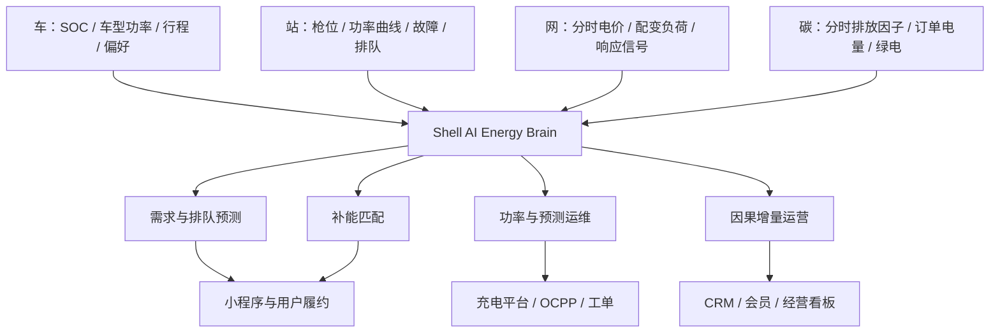

# 壳牌 × 杭州 · AI 能源大脑

> 车 · 网 · 碳一体化的城市能源转型商业解决方案  
> 2026 未来能源领袖计划 · AI + 能源创新商业挑战赛｜清能智策队

[在线体验 Demo](http://hawk-knko.upma.site/) · [查看路演 PDF](docs/清能智策队-终稿.pdf) · [下载完整 PPT](docs/清能智策队-终稿.pptx) · [观看 60 秒演示](assets/demo-60s.mp4)

## 项目概览

杭州的新能源汽车与充电基础设施持续增长，但用户仍面临“到站是否有枪、要等多久、实际能充多快”的不确定性；场站则面临冷热不均、故障停机、峰值电费与通用补贴侵蚀利润等问题。

本项目提出“壳牌杭州 AI 能源大脑”：连接车辆、场站、电网与碳排四类数据，以 AI 驱动站点推荐、充电履约、功率调度、预测运维和会员经营。核心目标不是单纯增加充电桩，而是让每一次补能都更可预测、可履约、可盈利。

## 核心方案

| 决策引擎 | AI 能力 | 业务动作 | 关键指标 |
| --- | --- | --- | --- |
| 需求与排队预测 | 预测未来 15–60 分钟到站量、可用枪位和 P50/P90 等待时间 | 识别高峰与空间需求，提前分流 | 到站转化率、平均等待时间、利用率 |
| 补能匹配 | 综合路程、等待、充电时长、费用、失败风险和碳排进行排序 | 推荐最优站与备选方案 | 到站成功率、订单转化、满意度 |
| 功率与运维 | 15 分钟滚动功率优化、枪级异常检测、故障预测 | 动态分配功率并自动生成工单 | 峰值负荷、单位电力成本、MTTR |
| 增量运营 | 用户分层、Uplift 因果增量模型、A/B 测试 | 只向会被权益改变的用户投放停车、咖啡、洗车或充电权益 | 30 天复充率、增量 ROI、非充电毛利 |

## Demo 用户旅程

### 1. AI 智选：从“离我最近”到“这次最确定”


系统结合车辆 SOC、车型受电功率、目的地、排队预测、实时价格与用户偏好，对站点进行个性化排序，并给出推荐理由与到站可启动概率。

### 2. 预约与履约：从“到站碰运气”到“预约、改派、可解释”


展示预计空枪、P50/P90 等待时间、分时价格与场站服务；设备或排队状态变化时，可在到站前推荐备选站，降低绕行与订单流失。

### 3. 智能充电：用户体验与场站成本进入同一目标函数


系统在配变容量、枪机功率、离站时间和电价约束下滚动分配功率，并向用户解释功率变化、预计完成时间和低碳时段占比。

### 4. 精准权益：把“全员撒券”变成可核验的用户投资


基于用户场景与因果增量预测选择停车减免、咖啡、洗车或下次充电券；只有预计增量贡献毛利高于权益与触达成本时才投放。

## 技术架构



模型与商业测算详见 [技术与商业说明](docs/技术与商业说明.md)。

## 试点设计

- **范围**：杭州 20 座代表性场站，覆盖交易、设备、会员、工单与单站损益数据。
- **0–2 个月**：统一数据字典和经营口径，历史回放识别每座站的主要约束。
- **3–4 个月**：AI 影子运行，同类型站点配对或分阶段 A/B 测试验证真实增量。
- **5–6 个月**：通过安全闸门后启用受控自动化，高置信故障自动派单，权益按增量效果投放。
- **验收**：到站转化、30 天复充、启动成功率、MTTR、峰值负荷、单位电力成本、单站增量利润与回收期。

## 本地运行

该 Demo 是无后端依赖的单文件静态原型：

```bash
python3 -m http.server 8000
```

然后访问 `http://localhost:8000/`。也可以直接打开根目录的 `index.html`。

## 仓库结构

```text
.
├── index.html                  # 完整 Demo 源码
├── assets/
│   ├── screenshots/           # 产品关键页面
│   └── demo-60s.mp4            # 60 秒路演演示
└── docs/
    ├── 清能智策队-终稿.pdf
    ├── 清能智策队-终稿.pptx
    ├── 路演文字稿.pdf
    ├── 路演文字稿.docx
    └── 技术与商业说明.md
```

## 说明

- 本仓库为商业比赛概念方案与交互原型，不代表壳牌官方产品或公开承诺。
- 财务测算、试点目标及经营改善幅度均为团队基于公开资料和明确假设形成的情景分析，应以真实试点数据复核。
- 项目涉及的品牌名称与商标归其各自权利人所有。本仓库未附开源许可证，未经许可请勿复制或商用其中的竞赛材料。

